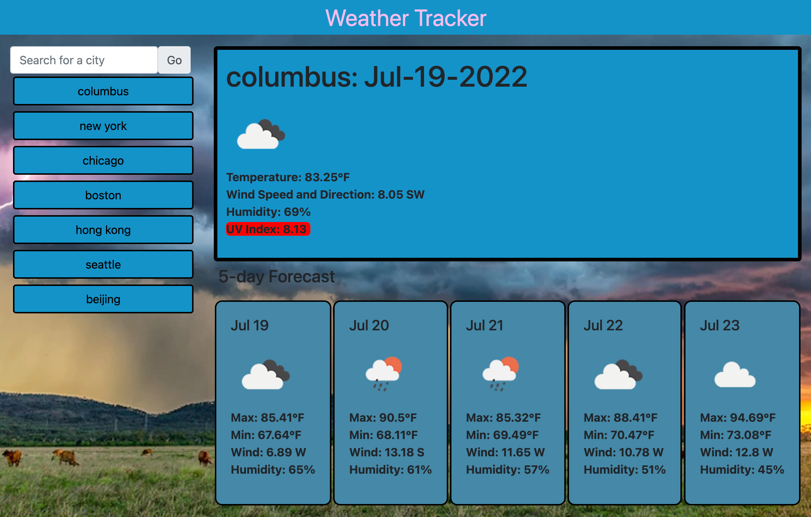

# Weather Tracker
An application that allows a user to see a live update of the weather in any city in the world by search

## Usage

[Deployed App Link](https://ivangoya.github.io/Weather-Tracker/)

## Contributing 
Pull requests are welcome. For major changes, please open an issue first to discuss what you would like to change.

## License
This project is licensed under MIT

## Questions

If you have any questions about this project, please contact me directly at ivan.goya98@gmail.com. You can view more of my projects at https://github.com/IvanGoya.
